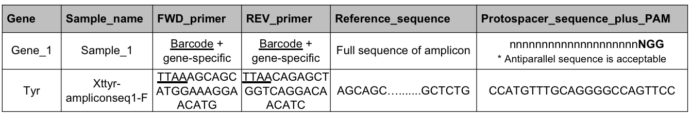

# CLiCKAR

## CLiCKAR is a web tool for practical genotyping and evaluation of CRISPR–Cas9-based knockout phenotypes using multiplexed amplicon sequencing. 

___
### How to use it?
#### 1) Prepare your “query table (.csv)”.

A comma-separated values (csv) data sheet is needed to run CLiCKAR. Query table requires gene name (Gene), 
sample name for individual crispant (Sample_name), forward (FWD_primer) 
and reverse (REV_primer) primer sequences with custom barcoded sequence (underlined) 
without Illumina overhang adaptor sequence, full reference sequence of target amplicon 
(Reference_sequence), and protospacer sequence with protospacer adjacent motif (PAM) 
(Protospacer_sequence_plus_PAM) in each amplicon region of on-target sites.

#### 2) Prepare your “fastq file (.fastq or .fastq.gz)”.
CLiCKAR accepts only single-end sequencing data. When paired-end sequencing data are used, both stranded reads must be joined by fastq-join or Pear in [Galaxy](https://usegalaxy.org); alternatively, one of the paired-end reads must be used in isolation. In the latter case, amplicons must be sequenced from end to end, because CLiCKAR must recognize both locus-specific primer sequences at the both ends during demultiplexing process.

#### 3) Run CLiCKAR in each step accordance with the instructions.
**Step 1 procedure**  
0. If necessary, download sample data files from ‘get sample!’ 
1. Browse your files from your computer through 'Select query table' panel.
    1. Select your query table (.csv).
    2. Select your fastq file (.fastq or .fastq.gz).

2. Click “CLiCKAR submit!” button.
3. Click “Download” button and get data files for Step 2.  
   The downloded file contains four files as described below.

    - '.fastq.gz' file: demultiplexed read files.
    - 'count_result.csv' file: read counts of each sample.
    - 'counts_readcounts.pdf' file: a bar plot of the read counts
    - 'demultiplexed_fastq.dat' file: a demultiplexed FASTQ data file as input data in Step 2.  

**Step 2 procedure**  
1. Browse your “demultiplexed_fastq.dat” file at Step 1 from your computer through the data upload panel.
2. Select your target gene from the drop-down menu.
3. Set minimum frequency (%) to omit sequence errors and rare reads.
4. Set target window (bp) to identified mutations around the ddouble strand break (DSB) site.
5. Click “CLiCKAR submit!” button.
6. Click “Download” button and get a data file containing four files below.

    - 'count.xlsx' file: the detail of mutation profiles in each sample.
    - 'indel_position.pdf'file: the putative position of the DSB.
    - 'mutation_rate.csv' file: the percentages of wild-, in-, or out-of-frame.
    - 'mutation_rate.pdf' file: graphical report of “muration_rate.csv”
